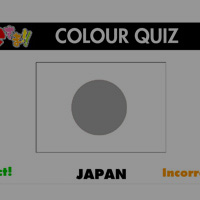
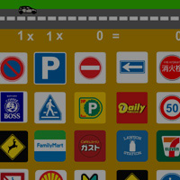

<html>
<head>
<meta http-equiv="Content-Type" content="text/html; charset=UTF-8">
 
<link rel="stylesheet" href="assets/stylesheet.css" type="text/css">

 </head>
 <body>

 Kitbox Design

<!-- centering div starts-->

<!-- main container starts-->

<table align="center" width="800px" height="600px" bgcolor="">
<tr>
<td colspan="5" align="center" class="header">
Learning games
</td>
</tr>

<tr>
<td>
Xmas Pairs Memory Game

 &nbsp;
</td>
<td>
 &nbsp;
</td>
<td>
 &nbsp;
</td>
<td>
 &nbsp;
</td>
<td>
 &nbsp;
</td>
</tr>

<tr>
<td>
 &nbsp;
</td>
<td>
 &nbsp;
</td>
<td>
 &nbsp;
</td>
<td>
 &nbsp;
</td>
<td>
 &nbsp;
</td>
</tr>
<tr >
<td colspan="5" align="center" bgcolor="#ff0000">
Quiz Games
</td>
</tr>
<tr>
<td>
 &nbsp;
</td>
<td>
 &nbsp;
</td>
<td>
 &nbsp;
</td>
<td>
 &nbsp;
</td>
<td>
 &nbsp;
</td>
</tr>
<tr>
<td>
 &nbsp;
</td>
<td>
 &nbsp;
</td>
<td>
 &nbsp;
</td>
<td>
 &nbsp;
</td>
<td>
 &nbsp;
</td>
</tr> 
</table> 
 

 <!-- main container ends-->

 <!-- centering div ends-->

 
</body>

</html>
