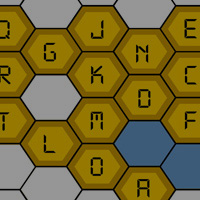
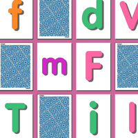

  <link rel="stylesheet" href="/assets/stylesheet.css">
 <body>
 KITBOX GAMES ABOUT BLOG CONTACT
 

 KITBOX GAMES

<h2>教育的で楽しいゲームとアップを使って、毎日英語でも学ぶ事が出来ます！このホームページに無料使えるやダウンロードができるので、是非お試して見て下さい！</h2>
 

<!-- centering div starts-->

<!-- main container starts-->

<table align="center" cellpadding="5" width="850px" height="600px" bgcolor="">
<tr>
<td colspan="5" align="center" class="header1">
トランプタイプゲーム
</td>
</tr>

<tr>
<td>

Xmas Pairs Game

 クリスマスの可愛い絵をして神経衰弱ゲーム。

ゲーム
  &nbsp; 
季節
&nbsp;
アップ
&nbsp;
洋風

</td>
<td>
 &nbsp;
</td>
<td>
 &nbsp;
</td>
<td>
 &nbsp;
</td>
<td>
 &nbsp;
</td>
</tr>
<tr>
<td colspan="5" align="center" class="header2">
クイズゲーム
</td>
</tr>

<tr>
<td>
 &nbsp;
</td>
<td>
 &nbsp;
</td>
<td>
 &nbsp;
</td>
<td>
 &nbsp;
</td>
<td>
 &nbsp;
</td>
</tr>
<tr>
<td colspan="5" align="center" class="header3">
パズルゲーム
</td>
</tr>
<tr>
<td>
 &nbsp;
</td>
<td>
 &nbsp;
</td>
<td>
 &nbsp;
</td>
<td>
 &nbsp;
</td>
<td>
 &nbsp;
</td>
</tr>
<tr>
<td>
 &nbsp;
</td>
<td>
 &nbsp;
</td>
<td>
 &nbsp;
</td>
<td>
 
</td>
<td>
 
</td>
</tr> 
</table>
</table> 
 

 <!-- main container ends-->

  <!-- centering div ends-->

 
</body>
 
